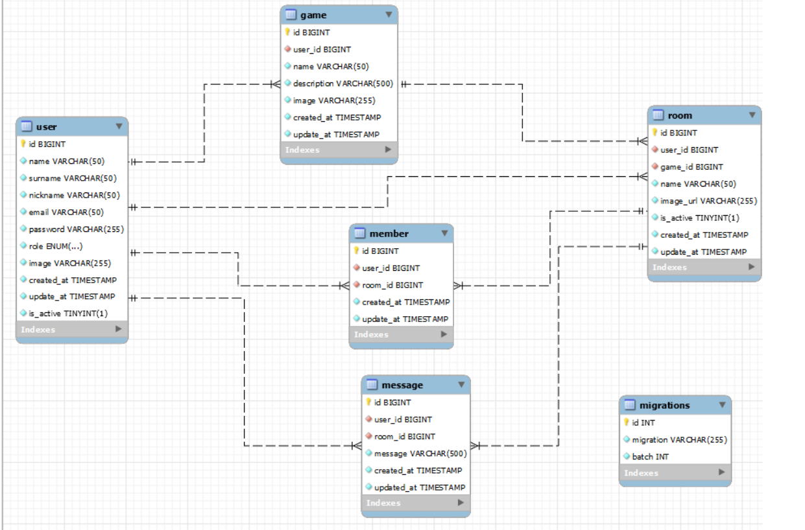
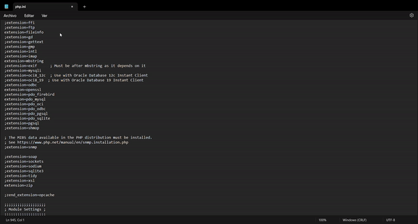

# README - 🕹️ Aplicación web LFG 🕹️
__<p align="center">Proyecto 6 - Full Stack Developer Bootcamp en GeeksHubs Academy </p>__

<p>
   <div align="center">
      
   </div>    
</p>
<br></br>

### 📋 Contenido del Readme

- <a href="#🚀-descripción"><h4>🚀 Descripción</h4></a>
- <a href="#🎯-objetivo"><h4>🎯 Objetivo</h4></a>
- <a href="#🛠️-tecnologías-utilizadas"><h4>🛠️ Tecnologías utilizadas</h4></a>
- <a href="#📉-diagrama-de-la-base-de-datos"><h4>📉 Diagrama de la base de datos</h4></a>
- <a href="#💡endpoints"><h4>💡 Endpoints</h4></a>
- <a href="#⚙️-instrucciones-de-uso"><h4>⚙️ Instrucciones de uso</h4></a>
- <a href="#⚠️-posibles-errores"><h4>⚠️ Posibles errores</h4></a>
- <a href="#📅-organización"><h4>📅 Organización</h4></a>
- <a href="#👏-agradecimientos"><h4>👏 Agradecimientos</h4></a>
- <a href="#🌟-mejoras"><h4>🌟 Mejoras</h4></a>
- <a href="#📧-contacto"><h4>📧 Contacto</h4></a>

<br></br>

## 🚀 Descripción

Este proyecto del Bootcamp Full Stack está enfocado en PHP, en él hemos puesto a prueba nuestros conocimientos en PHP y Laravel. Trabajando en equipo para crear una aplicación web LFG (Looking For Group).

Esta aplicación busca abordar la desconexión entre empleados que trabajan de forma remota, facilitando la formación de grupos para jugar videojuegos y disfrutar del tiempo libre después del trabajo.

## 🎯 Objetivo

Nuestro objetivo central es crear un backend completo, incluyendo la base de datos y la lógica en PHP con Laravel. Implementaremos funciones como registro y autenticación de usuarios, creación y búsqueda de partidas de videojuegos, gestión de usuarios en las partidas, chat común, administración de perfiles y cierre de sesión. Diseñaremos una API REST eficiente, aplicando prácticas sólidas de desarrollo, como el uso de middleware y servicios para optimizar los controladores. 


## 🛠️ Tecnologías Utilizadas

Para desarrollar este proyecto, hemos hecho uso de las siguientes tecnologías:

[]()  []()   []()  &nbsp;&nbsp;


</details>


## 📉 Diagrama de la base de datos

<p>
   <div align="center">
      
   </div>    
</p>


## 💡Endpoints

<details>
<summary>/user</summary>
<br>

1. Crear un usuario, registro.
    - Descripción: Crear un nuevo usuario, recuperando la información de los campos requeridos a través del body. Y, se genera un registro en la base de datos de un nuevo usuario con el rol de "user".

            POST http://127.0.0.1:8000/api/register

        Body:

             JSON
            {
               "name": "Zaira",
               "surname": "Guillem Perez",
               "nickname":"maguol",
               "email": "zaira@zaira.com",
               "password": " 123456"
            }
        
2. Login.
    - Descripción: Al acceder, nos devuelve un token a través del body que utilizaremos más tarde en las rutas habilitadas para los usuarios.

            POST http://127.0.0.1:8000/api/login 

        Body:

             JSON
            {
                "email": "zaira@zaira.com",
                "password": "123456"
            }

3. Logout.
    - Descripción:Cierra la sesión del usuario autenticado.

            POST http://127.0.0.1:8000/api/login 

        Body:

             JSON
            {
                "email": "zaira@zaira.com",
                "password": "123456"
            }

4. Obtener un usuario por Id.
    - Descripción: Obtener un usuario por el id, si el id enviado    corresponde con el id del token que hemos obtenido con el Login.

            GET http://127.0.0.1:8000/api/user/{id}  

        Auth:

            Auth : User 
            Barer token : Token
 
        
5. Actualizar un usuario por Id.
    - Descripción: Con el token obtenido al hacer Login, el usuario podra editar sus datos.

            PUT http://127.0.0.1:8000/api/user/{id}

        Auth:

            Auth : User 
            Barer token : Token


6. Eliminar un usuario por el Id.
    - Descripción: Eliminar un usuario por el id.

            DELETE http://127.0.0.1:8000/api/user/{id}          

        Auth:

            Auth : Admin
            Barer token : Token
       
7. Obtener todos los usuarios.
    - Descripción: Obtener los datos de todos los usuarios.

            GET http://127.0.0.1:8000/api/user

        Auth:

            Auth : User 
            Barer token : Token
    
</details>

<details>
<summary>/games</summary>
<br>

1. Crear un juego.
    - Descripción: Crear un juego.

            POST http://127.0.0.1:8000/api/createGame

        Auth:

             Auth : User 
             Barer token : Token

        Body:

              JSON
                {
                "name": "GTA",
                "description": "El mejor videojuego",
                "image": "https://image.api.playstation.com/vulcan/ap/rnd/202202/2816/mYn2ETBKFct26V9mJnZi4aSS.png"
                }  
 

2. Obtener todos los juegos.
    - Descripción: Obtener todos los juegos.

            GET http://127.0.0.1:8000/api/games

        Auth:

             Auth : User 
             Barer token : Token


3. Actualizar un juego por el Id.
    - Descripción: Actualizar un juego por el Id, siempre que el usuario que está intentando modificarlo sea el creador del mismo.

            POST http://127.0.0.1:8000/api/updateGameById/{id}

        Auth:

             Auth : User 
             Barer token : Token

        Body:

              JSON
                {
                "name": "GTA",
                "description": "El mejor videojuego",
                "image": "https://image.api.playstation.com/vulcan/ap/rnd/202202/2816/mYn2ETBKFct26V9mJnZi4aSS.png"
                }  


4. Recuperar un juego por el Id.
    - Descripción: Recuperar un juego por el Id.

            GET http://127.0.0.1:8000/api/getGameById/{id}

        Auth:

             Auth : User 
             Barer token : Token
            

5. Eliminar un juego por el Id.
    - Descripción: Eliminar un juego por el Id.

            POST http://127.0.0.1:8000/api/deleteGame/{id}

        Auth:

             Auth : User 
             Barer token : Token
            
                     
</details>

<details>
<summary>/room</summary>
<br>

1. Crear una sala.
    - Descripción: Crear una sala.

            POST http://127.0.0.1:8000/api/room


        Auth:

             Auth : User 
             Barer token : Token

        Body:

              JSON
                {
                "game_id": 3,
                "name":"Escuadrón GTA"
                }


2. Obtener todas las salas.
    - Descripción: Obtener todos las salas.

            GET http://127.0.0.1:8000/api/room

      Auth:

             Auth : User 
             Barer token : Token


3. Actualizar una sala por el Id.
    - Descripción: Actualizar una sala por el Id, siempre que el usuario que está intentando modificarlo sea el creador del mismo.

            PUT http://127.0.0.1:8000/api/room/{id}

      Auth:

             Auth : User 
             Barer token : Token
            
        Body:

              JSON
                {
                "name":"Malos GTA"
                }    
       

        NOTA: El usuario puede modificar cualquiera de los siguientes campos y, para realizar la actualización no es necesario introducir todos los campos.
                
                'game_id', 'name','image_url','is_active'
                
4. Recuperar una sala por el Id.
    - Descripción: Recuperar una sala por el Id.
                
            GET http://127.0.0.1:8000/api/room/{id}
        

      Auth:

             Auth : User 
             Barer token : Token
     
5. Recuperar todas las salas que sean activas.
    - Descripción: Recuperar una sala por el Id.
                
            GET http://127.0.0.1:8000/api/room/active
                

      Auth:

             Auth : User 
             Barer token : Token
            

6. Eliminar una sala por el Id.
    - Descripción: Eliminar una sala por el Id.
                
            POST http://127.0.0.1:8000/api/room/{id}
        

      Auth:

             Auth : User 
             Barer token : Token
            
               
</details>

<details>
<summary>/message</summary>
<br>

1. Crear un mensaje.
    - Descripción: Crear una mensaje.
      
             POST http://127.0.0.1:8000/api/createMessage

        Auth:

             Auth : User 
             Barer token : Token

        Body:

              JSON
                {
                "game_id": 3,
                "name":"Escuadrón GTA"
                }

2. Obtener todos los mensajes.
    - Descripción: Obtener todos los mensajes.

            GET http://127.0.0.1:8000/api/messages

        Auth:

             Auth : User 
             Barer token : Token

3. Actualizar un mensaje por el Id.
    - Descripción: Actualizar una sala por el Id, siempre que el usuario que está intentando modificarlo sea el creador del mismo.

            PUT http://127.0.0.1:8000/api/updatemessage/{id}

        Auth:

             Auth : User 
             Barer token : Token

        Body:

              JSON:
                {
                "message": "Hola Grupi"
                }

            
4. Recuperar un mensaje por el Id.
    - Descripción: Recuperar una sala por el Id.

            GET http://127.0.0.1:8000/api/message/{id}
        
        Auth:

             Auth : User 
             Barer token : Token
            
5. Eliminar un mensaje por el Id.
    - Descripción: Eliminar una sala por el Id.
            
            POST http://127.0.0.1:8000/api/deletemessage/{id}


        Auth:

             Auth : User 
             Barer token : Token
            
      
</details>
<details>
<summary>/members</summary>
<br>

1. Añadir un miembro a la sala.
    - Descripción: Añadir un miembro a la sala, si este la ha creado.
      
             POST http://127.0.0.1:8000/api/members

        Auth:

             Auth : User 
             Barer token : Token

        Body:

              JSON
                {
                "user_id": 2,
                "room_id": 10
                }

2. Añadirse a una sala.
    - Descripción: Formar parte de una sala ya creada.

            POST http://127.0.0.1:8000/api/member

        Auth:

             Auth : User 
             Barer token : Token


        Body:

              JSON
                {
                "room_id": 10
                }

3. Recuperar todas las salas en las que pertenece el usuario.
    - Descripción: Recuperar todas las salas a las que pertenece el usuario. Para ello, recuperamos su id del token.

            GET http://127.0.0.1:8000/api/member


        Auth:

             Auth : User 
             Barer token : Token

        Body:

              JSON:
                {
                "message": "Hola Grupi"
                }

            
4. Recuperar todos los miembros.
    - Descripción: Recuperar todos los usuarios y las salas.

            GET http://127.0.0.1:8000/api/members
        
        Auth:

             Auth : Admin 
             Barer token : Token

5. Recuperar todos los miembros de una sala.
    - Descripción: Recuperar todos los miembros que forman parte de una sala.
            
            GET http://127.0.0.1:8000/api/member/room


        Auth:

             Auth : User 
             Barer token : Token

        Body:

              JSON:
                {
                "room_id":9
                }


5. Eliminar un miembro.
    - Descripción: El creador de la sala puede eliminar un usuario de la misma.
            
            DELETE http://127.0.0.1:8000/api/member


        Auth:

             Auth : User 
             Barer token : Token

        Body:

              JSON:
                {
                "user_id":2,
                "room_id":9
                }

6. Salir de una sala.
    - Descripción: Salir de una sala a la que perteneces.
            
            DELETE http://127.0.0.1:8000/api/member/{$id}


        Auth:

             Auth : User 
             Barer token : Token

            
      
</details>

## ⚙️ Instrucciones de uso

1. Clona este repositorio en tu máquina local usando el siguiente comando: `git clone [URL del repositorio]`.
2. A continuación instala todas las dependencias con el comando ` composer install `.

3. Conectamos nuestro repositorio con la base de datos mediante las credenciales en el archivo con las variables de entorno que se encuentran en el archivo .env

    ``` 
    DB_CONNECTION=mysql
    DB_HOST=127.0.0.1
    DB_PORT=3306
    DB_DATABASE=laravel
    DB_USERNAME=root
    DB_PASSWORD=
    ```  

4. Ejecutamos las migraciones mediante el comando `php artisan migrate`.
5. Si estamos en desarrollo, lo hacemos funcionar y actualizarse en tiempo real mediante el comando `php artisan serve`.

## ⚠️ Posibles errores

<div style="text-align: center;">
    <div style="display: inline-block; margin: 3em;">
        
    </div>
</div>

## 📅 Organización
Para trabajar en equipo de forma organizada hemos utilizado las siguientes herramientas:
- Trello 🖇️

<div style="text-align: center;">
    <div style="display: inline-block; margin: 3em;">
        
    </div>
</div>

[Acceder a Trello](https://trello.com/invite/b/mSeMH7B8/ATTI759ea84de194ee4ce927949c8440304fA66B62BE/proyecto-laravel)


- Ramas en el repositorio 🪴

## 👏 Agradecimientos
Este proyecto es el reflejo de todos los conocimientos que hemos adquirido hasta la fecha en el BootCamp FullStack Developer.

## 🌟 Mejoras
<!-- TODO -->

## 📧 Contacto
Podéis contactar con nosotros a través de los siguientes medios de comunicación:

- ***Gaston Valentini***  
Contacta conmigo por correo electrónico [gastonvalentiniruiz@gmail.com](mailto:gastonvalentiniruiz@gmail.com). Además, puedes seguirme en [GitHub]((https://github.com/Gaston-Valentini))   | [LinkedIn](https://www.linkedin.com/in/gastonvalentini/)


- ***Marta Guillem***  
Contacta conmigo por correo electrónico [martaguillem@outlook.es](mailto:martaguillem@outlook.es). Además, puedes seguirme en [GitHub]((https://github.com/martaguillemolmos))   | [LinkedIn](https://www.linkedin.com/in/marta-guillem-olmos-b26b9b293/)


- ***Antonio insa***  
Contacta conmigo por correo electrónico [antonioinsa@tutanota.com](mailto:antonioinsa@tutanota.com). Además, puedes seguirme en [GitHub]((https://github.com/antonioinsa))   | [LinkedIn](https://www.linkedin.com/in/antonioinsa/)
